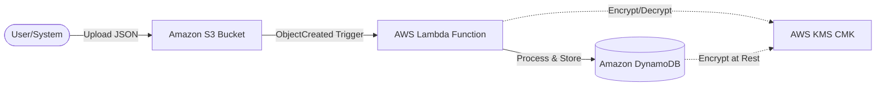

# Secure Event-Driven Payments Infrastructure

[](https://localstack.cloud/)
[](https://www.terraform.io/)
[](https://opensource.org/licenses/MIT)

A robust, enterprise-grade serverless payment processing pipeline built with **AWS Lambda**, **Amazon S3**, and **DynamoDB**. This project demonstrates best practices in **least-privilege security**, **KMS encryption**, and **event-driven architecture**, all running locally via **LocalStack**.

---

## Overview

This infrastructure automatically handles payment event archives. When a JSON payment record is uploaded to a secure S3 bucket, a Lambda function is triggered to process the data and persist it into an encrypted DynamoDB table.

### Key Features
- **Deterministic Deployment**: Fully automated via Terraform with a multi-workspace setup (`dev`, `prod`).
- **Military-Grade Security**: 
    - **Encryption at Rest**: S3 and DynamoDB are protected by a dedicated Customer Master Key (CMK) in KMS.
    - **Public Access Protection**: S3 Public Access Block (PAB) is strictly enforced.
    - **Granular IAM**: Lambda execution role follows the principle of least privilege.
- **Local-First Development**: Zero AWS costs using LocalStack and Docker Compose.

---

## Architecture



---

## Quick Start

### 1. Prerequisites
- [Docker & Docker Compose](https://www.docker.com/)
- [Terraform v1.5.7+](https://www.terraform.io/downloads.html)
- [AWS CLI](https://aws.amazon.com/cli/)

### 2. Launch Environment
```bash
# Start LocalStack
docker-compose up -d

# Initialize Infrastructure
.\terraform.exe init
.\terraform.exe workspace new dev
.\terraform.exe apply -auto-approve
```

---

## Verification Steps

### 1. Security Check
Ensure your infrastructure meets the predefined compliance standards:
```bash
# Verify S3 Encryption
aws --endpoint-url=http://localhost:4566 s3api get-bucket-encryption --bucket fintech-payment-events-dev

# Verify Public Access Block
aws --endpoint-url=http://localhost:4566 s3api get-public-access-block --bucket fintech-payment-events-dev
```

### 2. Functional Test
Upload a test payment and watch it process:
```bash
# Upload a sample payment
aws --endpoint-url=http://localhost:4566 s3 cp test_payment.json s3://fintech-payment-events-dev/

# Query the database
aws --endpoint-url=http://localhost:4566 dynamodb scan --table-name transactions-dev
```

---

## Project Structure
```text
├── src/
│   └── process_payment.py   # Lambda payment logic
├── main.tf                  # Infrastructure-as-Code
├── docker-compose.yml       # LocalStack configuration
├── .env.example             # Environment template
└── SUBMISSION_GUIDE.md      # Detailed verification guide
```

---
